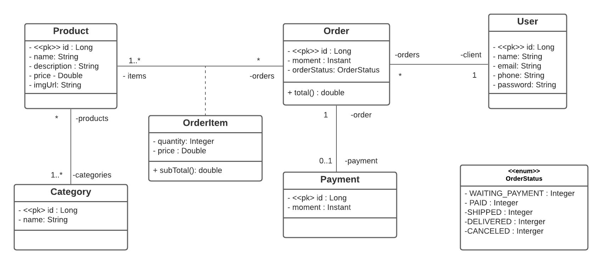
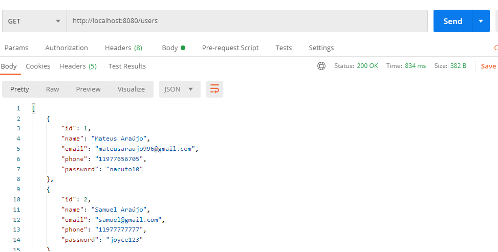
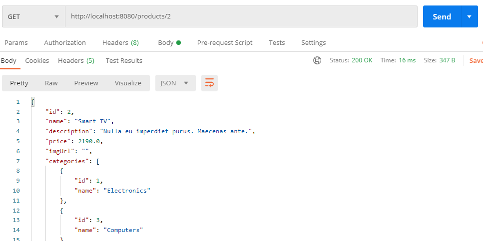

##  💻 Sobre o projeto <br/>

Projeto web services com Spring Boot e JPA / Hibernate. <br/>

### :memo: Objetivo: 
```bash
- Criar projeto Spring Boot Java
- Implementar modelo de domínio
- Estruturar camadas lógicas: resource, service, repository
- Configurar banco de dados de teste (H2)
- Povoar o banco de dados
- CRUD - Create, Retrieve, Update, Delete
- Tratamento de exceções 
- Deploy da aplicação no Heroku
```


## 🖼 Screenshot

## Diagrama de Classe

    	
    	<br/>
	
 
 ## Endpoints  

    	
	<br/>
    
  
    	
    <br/>


## 🛠 Tecnologias

As seguintes ferramentas foram usadas na construção do projeto:

 
-   **[Java](https://www.java.com/pt_BR/)**
-   **[SpringBoot](https://spring.io/)**
-   **[ApacheTomCat](http://tomcat.apache.org/)**
-   **[BancoDeDadosH2](https://www.h2database.com/html/main.html)**
-   **[GitBash](https://gitforwindows.org/)**
-   **[Postman](https://www.postman.com/)**

<br/>


# 👷 Como rodar
```bash
# Clonar o repositório
git clone https://github.com/teteusAraujo/web-services

# Exportar projeto para sua IDE

# Baixar as dependências


# Executar o programa

```

Feito isso, abra o seu navegador e acesse `http://localhost:8080/`

## 🤔 Como contribuir <br/>
```bash
- Faça um fork desse repositório;
- Cria uma branch com a sua feature: `git checkout -b minha-feature`;
- Faça commit das suas alterações: `git commit -m 'feat: Minha nova feature'`; 
- Faça push para a sua branch: `git push origin minha-feature`.

Depois que o merge da sua pull request ser feito, você pode deletar a sua branch. 
```

## ⚙️ Esta RestAPI esta hospedada no Heroku 
<h4>Você consegue acessar clicando : <a href="https://web-services-spring-boot.herokuapp.com/"> AQUI 👋</a></a></h4>

<!--Bottom session-->
<h4 align=center>Feito com ❤️ por  <a href="https://www.linkedin.com/in/mateusara%C3%BAjo/"> Mateus Araújo 👋</a></a></h4>